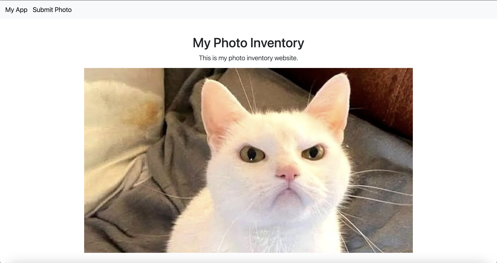
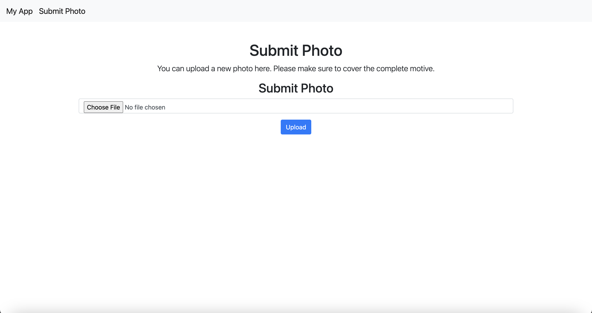
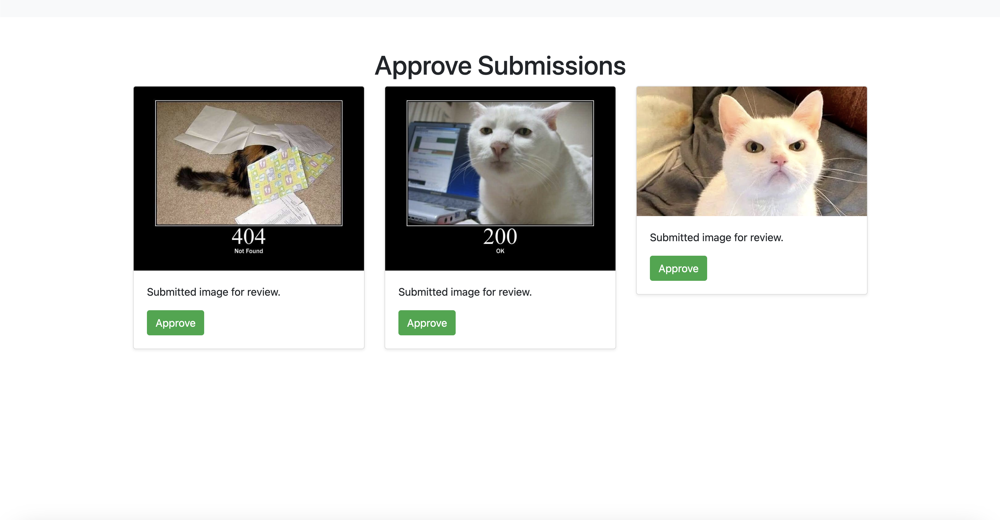

### Photo Inventory Service
This Python Webapp is a small service that will digitalize exchange places in local communities.
- People can open the website and submit a photo, to share the current items in the exchange
- Peopple can view the currently approved image of the exchange and see, which items are in the exchange for example
- An administrator can approve submissions to update the publicly visible photo of the inventory

_Index Page_

_Submit Photo_

_Approve Submission_

#### Getting Started
_S3 Storage:_
The app works with AWS S3. Therefore there must be:
- A (private) Bucket
- An IAM User with Access Key & Credentials and permissions to the Bucket (List Files, Get Files, Upload Files/Put)

_Config:_
There is a config at the root level. You can use this or specify a custom config and overwrite the env var `PHOTO_INVENTORY_CONFIG_PATH`. The following variables should be updated:

- ADMIN_PASS - the administration password used for sites such as accepting submissions. DO NOT USE THE DEFAULT PASSWORD.
- ACCESS_KEY - the AWS ACCESS KEY for the S3 Bucket
- SECRET_ACCESS_KEY - the SECRET ACCESS KEY for the S3 Bucket
- BUCKET_NAME - the AWS S3 Bucket Name where the photos should be stored
- DEBUG - true/false

Make sure to not push your config into the repository as it will contain secrets.

_Starting the App:_
Create a venv by running `python3 -m venv venv` and activate it by running `pip install -r requirements.txt`. Export your config file by running `export PHOTO_INVENTORY_CONFIG_PATH=MYPATH`. Then run `python app.py`.

_Running in Docker:_
Run `docker build . -t photo-inventory` (optionally tag the image). Run the image with your custom config `docker run -p 8080:5000 -e PHOTO_INVENTORY_CONFIG_PATH='<myconfig>' photo-inventory`. You can add the `--restart always` Flag to automatically restart the container.